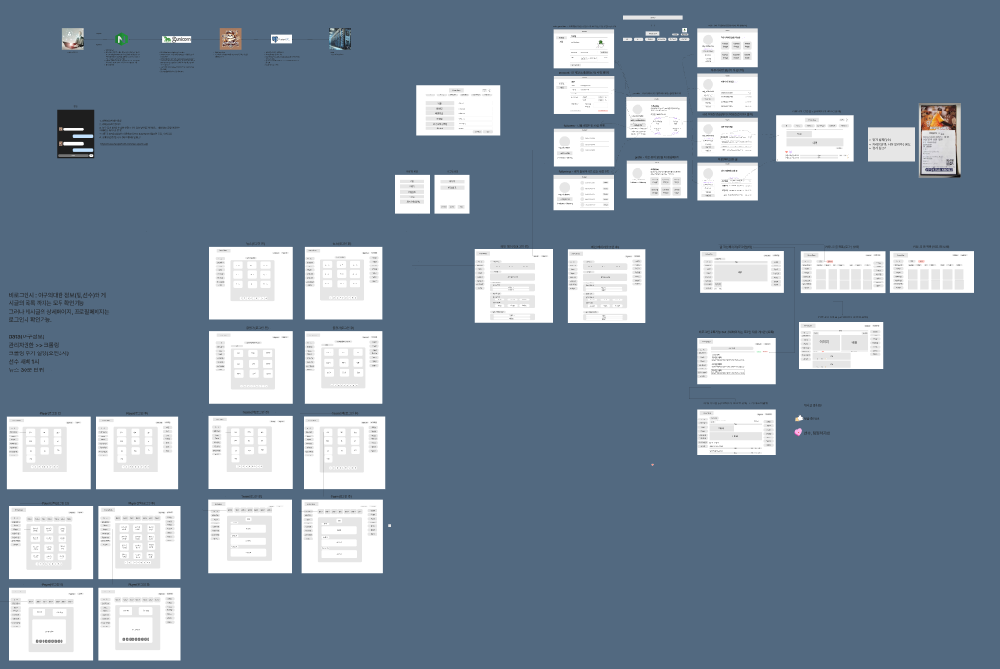
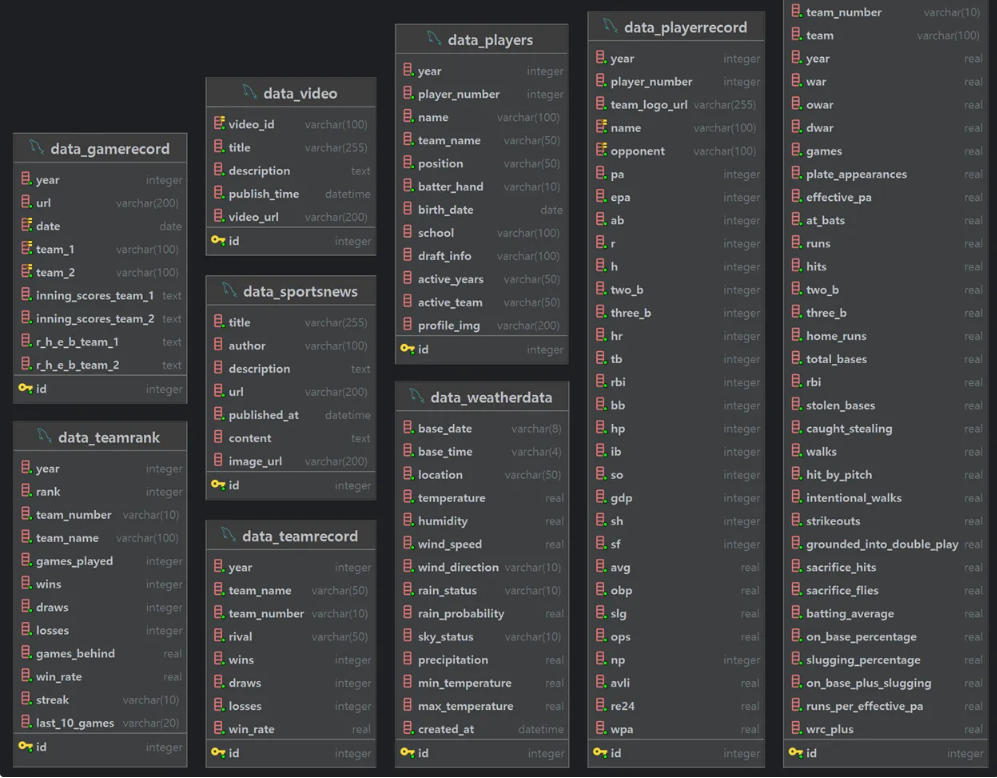
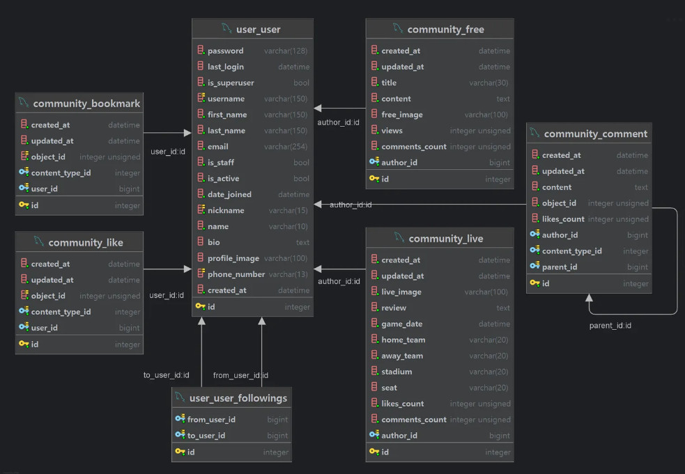

# homebase


# 프로젝트 이름
HomeBase

## 📖 목차
1. [프로젝트 소개](#프로젝트-소개)
2. [팀소개](#팀소개)
3. [프로젝트 계기](#프로젝트-계기)
4. [주요기능](#주요기능)
5. [개발기간](#개발기간)
6. [기술스택](#기술스택)
7. [서비스 구조](#서비스-구조)
8. [와이어프레임](#와이어프레임)
9. [API 명세서](#API-명세서)
10. [ERD](#ERD)
11. [프로젝트 파일 구조](#프로젝트-파일-구조)
12. [Trouble Shooting](#trouble-shooting)
    
## 👨‍🏫 프로젝트 소개


## 팀소개
#### - 팀명:  HomeBase
#### - 팀원:  김석환, 이서원, 이종화, 조준호
#### -github: https://github.com/seokhwan-ice/homebase/tree/main

## 💜 주요기능

- **USER**
    - 회원가입 : 클라이언트는 플랫폼에 가입하여 개인 계정을 생성할 수 있음.
    - 로그인 : 회원은 본인의 계정으로 로그인하여 더 많은 기능을 이용할 수 있음.
    - 로그아웃 : 회원은 본인의 로그인 세션을 종료할 수 있음.
    - 회원탈퇴 : 회원은 언제든지 본인의 계정을 삭제할 수 있으며, 탈퇴 시 서버에서 해당 계정은 비활성화로 전환됨.
    - 비밀번호 변경 : 회원은 본인의 비밀번호를 변경할 수 있음.
    - 프로필 조회 : 회원은 본인 혹은 다른 유저의 프로필을 조회할 수 있음. 
                  본인 프로필 조회 시, ‘작성한글’, ‘작성한댓글’, ‘북마크한글’ 등을 조회할 수 있음.
    - 프로필 수정 : 회원은 본인의 프로필 정보를 수정할 수 있음.
    - 팔로우 : 회원은 다른 유저들을 팔로우할 수 있으며, 다른 유저들로부터 팔로우를 받을 수 있음.
              또한, 본인 혹은 다른 유저의 프로필에서 팔로워 및 팔로잉 유저들을 수와 함께 확인할 수 있음.
    - 작성한 글 목록 : 회원은 본인의 프로필에서 본인이 작성한 글 목록을 조회할 수 있으며, 다른 유저의 프로필에서 해당 유저가 작성한 글 목록을 조회할 수 있음.
    - 작성한 댓글 목록 : 회원은 본인의 프로필에서 본인이 작성한 댓글 목록을 조회할 수 있음.
    - 북마크한 글 목록 : 회원은 본인이 북마크하여 저장한 게시글 혹은 기사 등을 조회할 수 있음.
    
    ---
    
- **DATA**
    - 야구 뉴스 : 클라이언트는 최근의 스포츠 뉴스 중에서 야구에 관련된 뉴스 목록을 조회할 수 있음.
    - 경기 일정 : 클라이언트는 야구 경기 일정(날짜, 경기 팀)을 월 별로 확인할 수 있음.
    - 선수 전력 목록 : 클라이언트는 선수들의 전력 목록을 조회할 수 있음.
    - 선수 전력 상세 : 클라이언트는 특정 선수의 전력 분석에 대한 상세 내용을 조회할 수 있음.
    - 팀 전력 목록 : 클라이언트는 팀의 전력 목록을 조회할 수 있음.
    - 팀 상대 전적 : 팀 vs 팀의 상대전적 확인 가능.
    - 팀 전력 상세 : 클라이언트는 특정 팀의 전력 분석에 대한 상세 내용을 조회할 수 있음.
    - 유튜브 : 유튜브에서 야구 응원가 관련 영상 확인가능함.
    
    ---
    
- **COMMUNITY**
    - 자유게시판 목록 : 클라이언트는 자유게시판의 목록을 조회할 수 있음. 최신순 혹은 인기순으로 정렬하여 다른 유저의 글을 확인할 수 있으며, 키워드를 통해 원하는 검색어가 제목 혹은 내용에 포함된 글만 필터링하여 검색할 수 있음.
    - 자유게시판 상세 : 클라이언트는 특정 글의 상세 페이지를 조회할 수 있음.
    - 자유게시판 등록 : 회원은 자유게시판에 글을 등록하여 질문이나 자랑 등 다른 회원들과 소통할 수 있음.
    - 자유게시판 수정 : 회원은 본인이 등록한 자유게시판 글을 수정할 수 있음.
    - 자유게시판 삭제 : 회원은 본인이 등록한 자유게시판 글을 삭제할 수 있음.
    - 직관 인증글 목록 : 클라이언트는 야구 경기를 직관한 것을 인증하는 인스타 형식의 게시판의 글 목록을 조회할 수 있음.
    - 직관 인증글 상세 : 클라이언트는 특정 글의 상세 페이지를 조회할 수 있음. 자유롭게 소통하는 기능 뿐 아니라, 경기 일자, 경기 팀, 경기 좌석 등을 확인하여 유용한 정보를 얻을 수 있음.
    - 직관 인증글 등록 : 회원은 야구 경기를 직관한 후 인증하는 인스타 형식의 글을 등록할 수 있음.
    - 직관 인증글 수정 : 회원은 본인이 등록한 직관 인증글을 수정할 수 있음.
    - 직관 인증글 삭제 : 회원은 본인이 등록한 직관 인증글을 삭제할 수 있음.
    - 댓글 등록 : 회원은 뉴스, 자유게시판, 직관인증게시판 등에 댓글을 등록할 수 있으며, 댓글에 대댓글을 등록할 수 있음.
    - 댓글 수정 : 회원은 본인이 등록한 댓글 혹은 대댓글을 수정할 수 있음.
    - 댓글 삭제 : 회원은 본인이 등록한 댓글 혹은 대댓글을 삭제할 수 있음.
    - 글 좋아요 : 회원은 뉴스, 자유게시판, 직관인증게시판 등에 좋아요를 누를 수 있으며, 한 유저는 같은 글에 한번만 좋아요를 누를 수 있음. 좋아요 수는 카운트되어서 인기순 정렬 데이터를 제공하기 위한 목적으로 사용됨.
    - 글 좋아요 취소 : 회원은 본인이 좋아요를 누른 글에 좋아요를 취소할 수 있음.
    - 댓글 좋아요 : 회원은 댓글 혹은 대댓글에 좋아요를 누를 수 있으며, 한 유저는 같은 댓글에 한번만 좋아요를 누를 수 있음. 좋아요 수는 카운트되어 표시됨.
    - 댓글 좋아요 취소 : 회원은 본인이 좋아요를 누른 댓글 혹은 대댓글에 좋아요를 취소할 수 있음.
    - 북마크 : 회원은 뉴스, 자유게시판, 직관인증게시판 등에서 마음에 드는 글을 북마크하여 저장할 수 있으며, 북마크된 글들은 본인의 프로필을 통해 추후에도 확인할 수 있음.
    - 북마크 취소 : 회원은 자신이 북마크한 글에 북마크를 취소할 수 있음.
    
    ---
    
- **기타 서비스**
    - AI 챗봇 : 회원은 AI 챗봇 서비스를 통해 1:1로 궁금한 점을 질문하고 응답을 받을 수 있음. 찾아보기 귀찮은 내용에 대해 빠르고 쉽게 답변을 얻을 수 있음.
    - 실시간 채팅 : 회원은 실시간 채팅 서비스를 통해 단체채팅방 형식으로 타 유저들과 실시간으로 소통할 수 있음.


## ⏲️ 개발기간
2024.09.23(월)~2024.10.24(목)
## 📚️ 기술스택

### ✔️ Language

    ● python

### ✔️ Version Control

    ● Git
    ● GitHub

### ✔️ IDE

    ● Visual Studio Code
    ● PyCharm

### ✔️ Framework

    ● Django


### ✔️  DBMS

    ● SQLite3(로컬)
    ● Postgre(서버)

### ✔️ COMMUNICATION

    ● slack
    ● zep
    ● notion


## 와이어프레임


- [HomeBase 와이어프레임_링크](https://www.figma.com/board/EXXGmowQJDaa2qfTEWxI4v/HomeBase?node-id=0-1&node-type=canvas&t=1hxOU49yLHl8qZmy-0)


## API 명세서

- [HomeBase API 명세서](https://teamsparta.notion.site/API-8f01afa9c1614f6584700a655e30d3f8)

## ERD
### - DATA/Crawling


### - USER/Community


### - AI CHAT/Group Chat


## 프로젝트 파일 구조

``` 
여기는 수정해야함@@
📦 
├─ README.md
├─ homebase
│  ├─ __init__.py
│  ├─ asgi.py
│  ├─ settings.py
│  ├─ urls.py
│  └─ wsgi.py
├─ accounts
│  ├─ __init__.py
│  ├─ admin.
│  ├─ apps.py
│  ├─ migrations
│  │  ├─ 0001_initial.py
│  │  └─ __init__.py
│  ├─ models
│  ├─ serializers.py
│  ├─ tests.py
│  ├─ urls.py
│  ├─ validators.py
│  └─ views.py
├─ headline_crawling.py
├─ manage.py
├─ media
│  └─ images
│     ├─ pngwing.com_9.png
│     ├─ pngwing.com_9_JjSePaS.png
│     ├─ pngwing.com_9_YrpN9ne.png
│     └─ pngwing.com_9_kMyzdKD.png
├─ openai_test.py
├─ posts
│  ├─ __init__.py
│  ├─ adm
│  ├─ apps.py
│  ├─ crawling.py
│  ├─ migrations
│  │  ├─ 0001_initial.py
│  │  └─ __init__.py
│  ├─ models.
│  ├─ serializers.py
│  ├─ tests.py
│  ├─ urls.py
│  ├─ validators.py
│  └─ views.py
└─ requirements.txt
```
©generated by [Project Tree Generator](https://woochanleee.github.io/project-tree-generator)


## Trouble Shooting

- [HomeBase 트러블 슈팅(노션)](https://teamsparta.notion.site/HomeBase-fff2dc3ef51481daa2addec78dfe0e0d)


---


